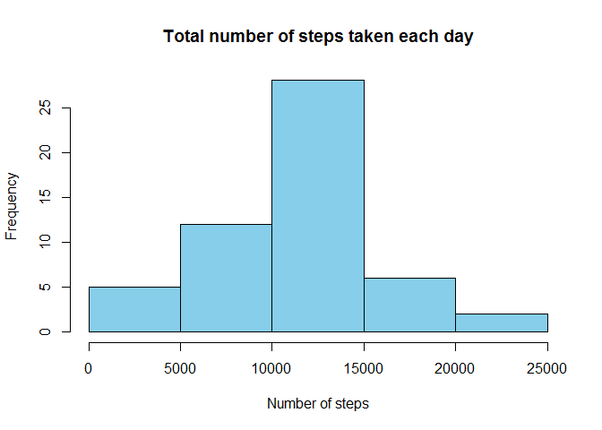
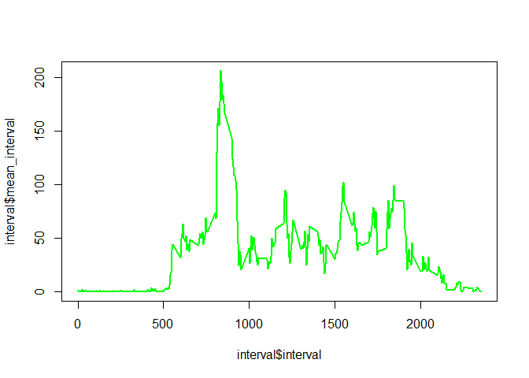
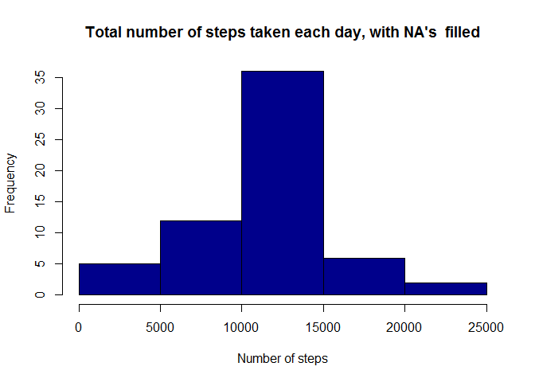
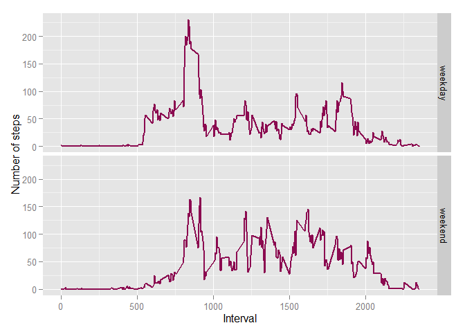

# Reproducible Research: Peer Assessment 1

This document illustrates the workflow for the PeerAssessment 1.

It is assumed that the "activity.zip" is downloaded and the working directory is set to the directory containing the "activity.zip".

## Loading and preprocessing the data


Unzip and read data:

```r
unzip("activity.zip")
data <- read.csv("activity.csv")
```

Transform values in the date column into Date

```r
data$date <- as.Date(data$date, "%Y-%m-%d")
```


## What is mean total number of steps taken per day?

Load package dplyr

```r
library(dplyr)
```

Compute sum of steps per day

```r
summ <- summarise(group_by(data, date), sumstep = sum(steps))
```

Make histogramm of total number of steps taken each day

```r
hist(summ$sumstep, main = "Total number of steps taken each day", xlab = "Number of steps", col = "skyblue")
```

 

Calculate the mean and median of the total number of steps taken per day

```r
mean_steps <- mean(summ$sumstep, na.rm = TRUE)
mean_steps
```

```
## [1] 10766.19
```

```r
median_steps <- median(summ$sumstep, na.rm = TRUE)
median_steps
```

```
## [1] 10765
```


## What is the average daily activity pattern?

#### 1. Make a time series plot (i.e. type = "l") of the 5-minute interval (x-axis) and the average number of steps taken, averaged across all days (y-axis)
Compute mean of every interval and make plot

```r
interval <- summarise(group_by(data, interval), mean_interval = mean(steps, na.rm = TRUE))
plot(interval$interval, interval$mean_interval, type = "l", col = "green", lwd = 2)
```

 

#### 2. Which 5-minute interval, on average across all the days in the dataset, contains the maximum number of steps?
If we look at the plot, we see the interval with most averaged steps is around 800.
Let us find this exactly:

```r
max_steps <- max(interval$mean_interval)
fr_interval <- filter(interval, mean_interval == max_steps) 
fr_interval[1,1]
```

```
## Source: local data frame [1 x 1]
## 
##   interval
## 1      835
```
The interval 835 contains the averaged maximum number of steps.

## Imputing missing values

#### 1. Calculate and report the total number of missing values in the dataset

Calculating the number of NA's:

```r
has_NA <- filter(data, is.na(steps))
dim(has_NA)[1] # shows number of rows in the has_NA subset
```

```
## [1] 2304
```
The data contains 2304 missing values.

#### 2. Devise a strategy for filling in all of the missing values in the dataset.
Missing values will be filled in with the average number of steps in the corresponding interval.
#### 3. Create a new dataset that is equal to the original dataset but with the missing data filled in.


```r
data_onlyNA <- filter(data, is.na(data$steps)) ## find only the rows with NA's
merged <- merge(data_onlyNA, interval) ## find the value to fill in, which is the averaged number of steps per interval
merged$steps <- merged$mean_interval ## set values
merged$mean_interval <- NULL ## remove unnecessary data
data_noNA <- filter(data, !is.na(data$steps)) ## subset with no NA's
data_filledNA <- rbind(data_noNA, merged) ## combine subsets with no NA's and filled NA's
data_filledNA <- arrange(data_filledNA, date) ## sort
data_filledNA$steps <- round(data_filledNA$steps) ## normalise the number of steps
```

#### 4. Make a histogram of the total number of steps taken each day.

```r
summ_filled <- summarise(group_by(data_filledNA, date), sumstep = sum(steps))
hist(summ_filled$sumstep, main = "Total number of steps taken each day, with NA's  filled", 
     xlab = "Number of steps", col = "darkblue")
```

 

#### Calculate the mean and median of the total number of steps taken per day

```r
mean_steps_filled <- mean(summ_filled$sumstep)
mean_steps_filled 
```

```
## [1] 10765.64
```

```r
median_steps_filled <- median(summ_filled$sumstep)
median_steps_filled 
```

```
## [1] 10762
```

#### Do these values differ from the estimates from the first part of the assignment? What is the impact of imputing missing data on the estimates of the total daily number of steps?
The mean and median don't change much, when missing values are filled in: 

**type** | **with NA**  | **filled NA** 
------------- | ------------- | -------------
**mean** | 10766.19  | 10765.64
**median** | 10765  | 10762 

There is a difference in the daily total number of steps: the most frequent pattern 1000-1500 steps per day becomes even more important wih the value near 35, whereas the same pattern in the data with missing values is around 25.

## Are there differences in activity patterns between weekdays and weekends?
#### 1. Create a new factor variable in the dataset with two levels - "weekday" and "weekend" indicating whether a given date is a weekday or weekend day.

Mark week days in the data set with filled in NA's:

```r
data_filledNA$wdays <- weekdays(data_filledNA$date)
data_filledNA$wdays[which(data_filledNA$wdays != "Sunday" & data_filledNA$wdays != "Saturday")] <- "weekday"
data_filledNA$wdays[which(data_filledNA$wdays == "Sunday" | data_filledNA$wdays == "Saturday")] <- "weekend"
data_filledNA$wdays <- as.factor(data_filledNA$wdays) ## convert to factor
```
#### 2. Make a panel plot containing a time series plot (i.e. type = "l") of the 5-minute interval (x-axis) and the average number of steps taken, averaged across all weekday days or weekend days (y-axis).


```r
library(ggplot2)
interval_filledNA <- summarise(group_by(data_filledNA, interval, wdays), mean_interval = mean(steps, na.rm = TRUE))
g <- ggplot(interval_filledNA, aes(interval, mean_interval))
g+geom_line(col = "deeppink4", lwd =1)+facet_grid(wdays~.)+xlab("Interval")+ylab("Number of steps")
```

 

Q: Are there differences in activity patterns between weekdays and weekends?

As we see from the plot there is an increase in averaged number of steps in the mornings 7:00-9:00 and evenings around 18:00 compared to weekends and on the contrary increase in moving at the weekends between 12:00 and 16:00.

---------------------------------------------------------------------------------------------------------


